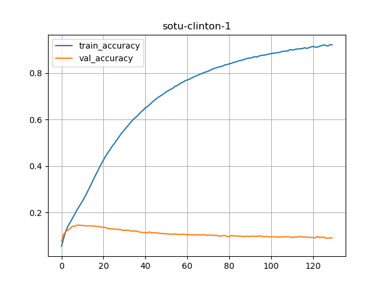
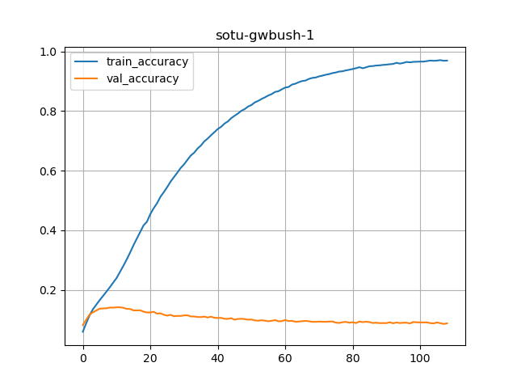
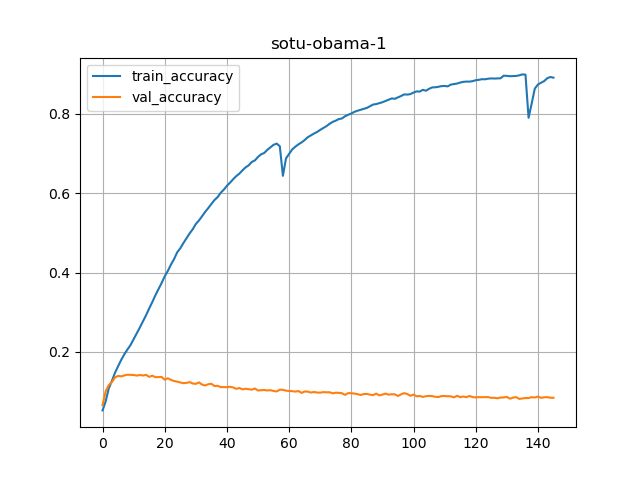
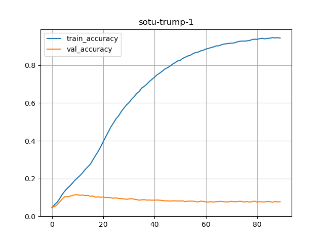
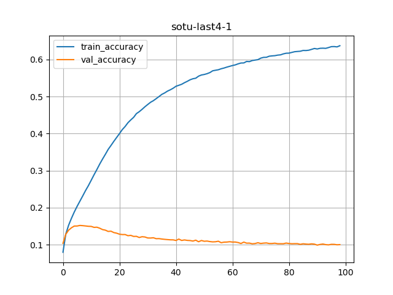
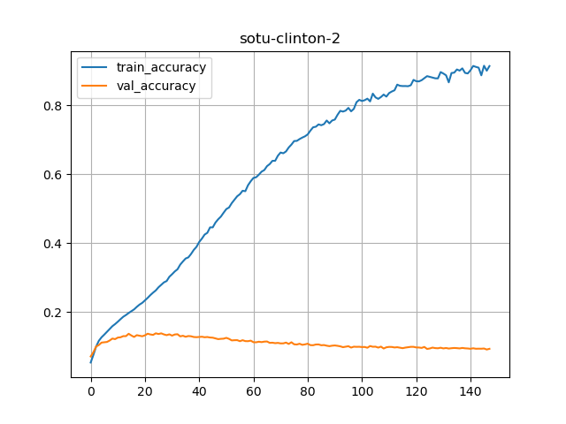
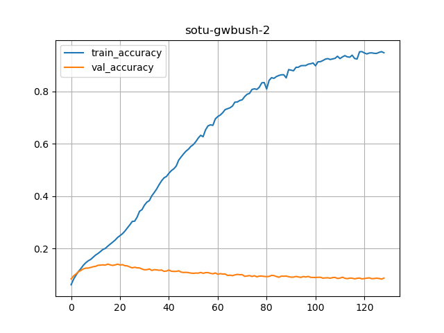
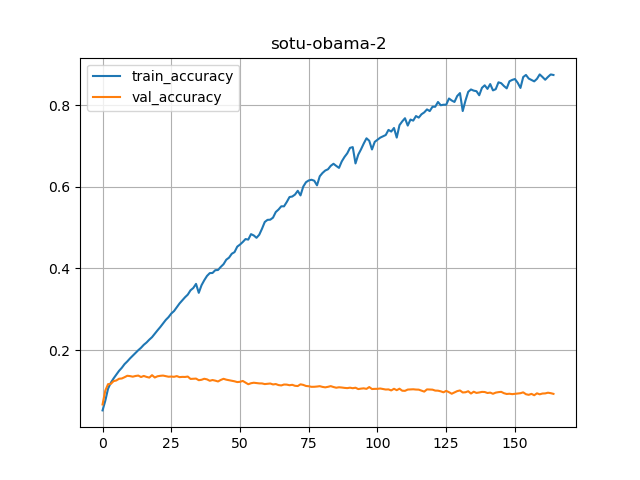
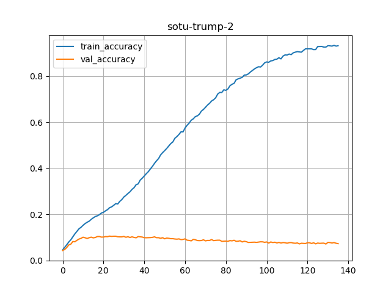
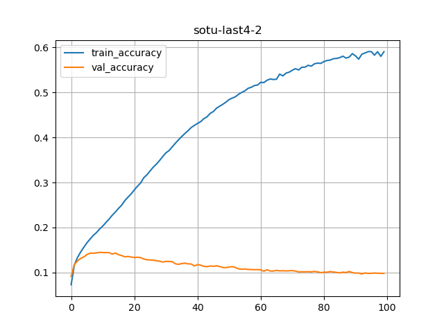

# SOTU Text Generation

We have trained models on SOTU texts and then they can generate texts.

We have 5 language models
- Clinton
- GWBush
- Obama
- Trump
- All of it (last4)


See below for notes.

Useful links
- https://towardsdatascience.com/devops-for-data-science-with-gcp-3e6b5c3dd4f6

## Installing required packages

```bash
    $  conda install humanize
```

## Workflow

### Experimenting

Training takes a while, easily 20 minutes  to 4-5 hours.

We have two notebooks

- one for training : for experimenting
- and one for predicting

### Scripting

And I have python scripts that generates multiple models in one go.

### Model Serving

A flask application in `model-serving` directory.  See [model-serving/README.md](model-serving/README.md) for more details.

## Experimenting with Models

I wanted to experiment with various models.  
Pretty much all models overfit (large degree)

### Text charecteristics

| Data    | Total number of words | Total unique words | max sequence len |
|---------|-----------------------|--------------------|------------------|
| Clinton | 51,977                | 4,526              | 284              |
| GWBush  | 44,282                | 4,701              | 182              |
| Obama   | 53,895                | 4,957              | 132              |
| Trump   | 22,349                | 3,539              | 159              |
| all     | 172,503               | 8,934              | 284              |


### Model 1 - Smaller Model

This model surprisingly works well.  
And achieves pretty good training accuracy (around 90%) on most texts

```python

# model 1
model_version = "1"
model = Sequential([
            Embedding(input_dim=num_unique_words, output_dim=100, input_length=max_sequence_len-1),
            Bidirectional(LSTM(64)),
            Dense(num_unique_words, activation='softmax')
    ])

model.compile(loss='categorical_crossentropy',
              optimizer = 'adam',
              metrics=['accuracy'])

cb_early_stop = tf.keras.callbacks.EarlyStopping(monitor='accuracy', min_delta=0.01, patience=10, verbose=1)

history = model.fit(xs, ys, validation_split=0.2, epochs=500, 
                    verbose=1, callbacks=[tensorboard_callback, cb_early_stop])

```

| Data    | Number of parameters | Total Epochs before early stopping | Accuracy % | Training Time                      |
|---------|----------------------|------------------------------------|------------|------------------------------------|
| Clinton | 1,120,934            | 130                                | 92.12      | 1 hour, 57 minutes and 48 secs     |
| GWBush  | 1,161,009            | 109                                | 96.96      | 1 hour, 2 minutes and 22 seconds   |
| Obama   | 1,219,633            | 146                                | 89.15      | 1 hour, 19 minutes and 48 seconds  |
| Trump   | 894,911              | 90                                 | 94.41      | 22 minutes and 11.32 seconds       |
| all     | 2,130,366            | 99                                 | 63.70      | 4 hours, 48 minutes and 30 seconds |








### Model 2 - 2 biLSTMs

```python

model = Sequential([
            Embedding(input_dim=total_words, output_dim=100, input_length=max_sequence_len-1),
            Bidirectional(LSTM(64, return_sequences=True)),
            Bidirectional(LSTM(64)),
            Dense(total_words, activation='softmax')
    ])

model.compile(loss='categorical_crossentropy', 
              optimizer = 'adam',
              metrics=['accuracy'])

cb_early_stop = tf.keras.callbacks.EarlyStopping(monitor='accuracy', min_delta=0.05, patience=20, verbose=2)

history = model.fit(xs, ys, validation_split=0.2, epochs=500, 
                    verbose=1, callbacks=[tensorboard_callback, cb_early_stop])

```









## Experiment 3 - 2 biLSTMs + Dropout

```python

model = Sequential([
            Embedding(input_dim=total_words, output_dim=100, input_length=max_sequence_len-1),
            Bidirectional(LSTM(64, return_sequences=True)),
            Dropout(0.3),
            Bidirectional(LSTM(64)),
            Dense(total_words, activation='softmax')
    ])

model.compile(loss='categorical_crossentropy', 
              optimizer = 'adam',
              metrics=['accuracy'])

cb_early_stop = tf.keras.callbacks.EarlyStopping(monitor='accuracy', min_delta=0.05, patience=20, verbose=2)

history = model.fit(xs, ys, validation_split=0.2, epochs=500, 
                    verbose=1, callbacks=[tensorboard_callback, cb_early_stop])

```


