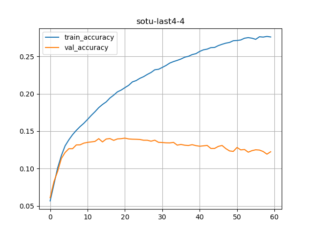

# SOTU Text Generation

## About

I trained models on past state of the union speech texts from various presidents (Clinton, GW Bush, Obama, Trump). Then I gave the models 'a starter text' (seed input) and asked them generate text.

### Fun examples

For the seed text of `american workers` here are the outputs from various models

- **clinton-1**: `american workers` cuts the deficit is not enough we should be time to the senate to approave start to eliminate weapons

- **gwbush-1**: `american workers` make right energy to our high we have seen for battle we citizens in this chamber to win the war

- **obama-1**: `american workers` are american diplomacy backed by hard work and american people can be in this moment is real to end

- **trump-1**: `american workers` and american families are left to the united states reciprocal trade act so that our country look at standing


[screenshot-1](media/sotu-demo-1.png)  •  [screenshot-2](media/sotu-demo-2.png)

It's fun to watch the themes of each generated text!

## Models

We have trained models on past SOTU texts.  Models are bidirectional LSTM.

[model architecture](media/model.png)

We have 5 language models

- Clinton
- GWBush
- Obama
- Trump
- All of it (last4)

Model files are [here](models/)


[README-dev.md](README-dev.md) has more developer notes

## Workflow

### Experimenting

Training takes a while, easily 20 minutes  to 4-5 hours.

We have two notebooks

- one for training : for experimenting
- and one for predicting

### Scripting

And I have python scripts that generates multiple models in one go.

### Model Serving

A flask application in `model-serving` directory.  See [model-serving/README.md](model-serving/README.md) for more details.

## Experimenting with Models

I wanted to experiment with various models.
Pretty much all models overfit (large degree)

### Data characteristics

| Data    | Total number of words | Total unique words | max sequence len |
|---------|-----------------------|--------------------|------------------|
| Clinton | 51,977                | 4,526              | 284              |
| GWBush  | 44,282                | 4,701              | 182              |
| Obama   | 53,895                | 4,957              | 132              |
| Trump   | 22,349                | 3,539              | 159              |
| all     | 172,503               | 8,934              | 284              |


### Model 1 - Smaller Model

This model surprisingly works well.
And achieves pretty good training accuracy (around 90%) on most texts

```python

# model 1
model_version = "1"
model = Sequential([
            Embedding(input_dim=num_unique_words, output_dim=100, input_length=max_sequence_len-1),
            Bidirectional(LSTM(64)),
            Dense(num_unique_words, activation='softmax')
    ])

model.compile(loss='categorical_crossentropy',
              optimizer = 'adam',
              metrics=['accuracy'])

cb_early_stop = tf.keras.callbacks.EarlyStopping(monitor='accuracy',
                          min_delta=0.01, patience=10, verbose=1)

history = model.fit(xs, ys, validation_split=0.2, epochs=500,
                    verbose=1, callbacks=[tensorboard_callback, cb_early_stop])

```

| Data    | Parameters | Model Size | Epochs  | Accuracy % | Training Time                      |
|---------|----------------------|------------|----------------|------------|------------------------------------|
| Clinton | 1,120,934            | 13.5 MB    | 130            | 92.12      | 1 hour, 57 minutes and 48 secs     |
| GWBush  | 1,161,009            | 14.0 MB    | 109            | 96.96      | 1 hour, 2 minutes and 22 seconds   |
| Obama   | 1,219,633            | 14.7 MB    | 146            | 89.15      | 1 hour, 19 minutes and 48 seconds  |
| Trump   | 894,911              | 10.8 MB    | 90             | 94.41      | 22 minutes and 11.32 seconds       |
| all     | 2,130,366            | 25.6 MB    | 99             | 63.70      | 4 hours, 48 minutes and 30 seconds |


### Model 2 - 2 biLSTMs

```python

model = Sequential([
            Embedding(input_dim=total_words, output_dim=100, input_length=max_sequence_len-1),
            Bidirectional(LSTM(64, return_sequences=True)),
            Bidirectional(LSTM(64)),
            Dense(total_words, activation='softmax')
    ])

model.compile(loss='categorical_crossentropy',
              optimizer = 'adam',
              metrics=['accuracy'])

cb_early_stop = tf.keras.callbacks.EarlyStopping(monitor='accuracy',
                        min_delta=0.05, patience=20, verbose=2)

history = model.fit(xs, ys, validation_split=0.2, epochs=500,
                    verbose=1, callbacks=[tensorboard_callback, cb_early_stop])

```

| Data    | Parameters | Model Size | Epochs  | Accuracy % | Training Time                         |
|---------|----------------------|------------|----------------|------------|---------------------------------------|
| Clinton | 1,219,750            | 14.7 MB    | 148            | 91.35      | 3 hours, 21 minutes and 25.89 seconds |
| GWBush  | 1,259,825            | 12.2 MB    | 129            | 94.72      | 1 hour, 38 minutes and 45.70 seconds  |
| Obama   | 1,318,449            | 15.9 MB    | 165            | 87.41      | 2 hours, 19 minutes and 3.25 seconds  |
| Trump   | 993,727              | 12.0 MB    | 136            | 93.24      | 51 minutes and 54.15 seconds          |
| all     | 2,229,182            | 26.8 MB    | 100            | 59.06      | 7 hours, 34 minutes and 17.98 seconds |


## Model 3 - 2 biLSTMs + Dropout

```python

model = Sequential([
            Embedding(input_dim=total_words, output_dim=100, input_length=max_sequence_len-1),
            Bidirectional(LSTM(64, return_sequences=True)),
            Dropout(0.3),
            Bidirectional(LSTM(64)),
            Dense(total_words, activation='softmax')
    ])

model.compile(loss='categorical_crossentropy',
              optimizer = 'adam',
              metrics=['accuracy'])

cb_early_stop = tf.keras.callbacks.EarlyStopping(monitor='accuracy',
                        min_delta=0.05, patience=20, verbose=2)

history = model.fit(xs, ys, validation_split=0.2, epochs=500,
                    verbose=1, callbacks=[tensorboard_callback, cb_early_stop])

```

| Data    | Parameters | Model Size | Epochs  | Accuracy % | Training Time                         |
|---------|----------------------|------------|----------------|------------|---------------------------------------|
| Clinton | 1,219,750            | 14.7 MB    | 176            | 77.44      | 4 hours, 25 minutes and 0.92 seconds  |
| GWBush  | 1,259,825            | 15.2 MB    | 174            | 81.99      | 2 hours, 18 minutes and 40.00 seconds |
| Obama   | 1,318,449            | 15.9 MB    | 152            | 73.32      | 2 hours, 9 minutes and 36.04 seconds  |
| Trump   | 993,727              | 12.0 MB    | 158            | 86.68      | 56 minutes and 41.30 seconds          |
| all     | 2,229,182            | 26.4 MB    | 117            | 41.79      | 6 hours, 25 minutes and 27.42 seconds |


## Model 4 - biLSTM + DropOut + LSTM + Dense

This is from [Laurence Moroney's Shakespeare notebook](https://github.com/lmoroney/dlaicourse/blob/master/TensorFlow%20In%20Practice/Course%203%20-%20NLP/NLP_Week4_Exercise_Shakespeare_Answer.ipynb)

```python
from tensorflow.keras import regularizers

## Model 4: from https://github.com/lmoroney/dlaicourse/blob/master/TensorFlow%20In%20Practice/Course%203%20-%20NLP/NLP_Week4_Exercise_Shakespeare_Answer.ipynb
    model_version = "4"
    model = Sequential( [
        Embedding(num_unique_words, 100, input_length=max_sequence_len-1),
        Bidirectional(LSTM(150, return_sequences = True)),
        Dropout(0.2),
        LSTM(100),
        Dense(num_unique_words/2, activation='relu', kernel_regularizer=regularizers.l2(0.01)),
        Dense(num_unique_words, activation='softmax')
    ])
model.compile(loss='categorical_crossentropy',
        optimizer = 'adam',
        # optimizer = Adam(lr=0.01)
        metrics=['accuracy'])
cb_early_stop = tf.keras.callbacks.EarlyStopping(monitor='accuracy',
                        min_delta=0.05, patience=20, verbose=2)

history = model.fit(xs, ys, validation_split=0.2, epochs=500,
                    verbose=1, callbacks=[tensorboard_callback, cb_early_stop])

```

| Data    | Parameters | Model Size | Epochs | Accuracy % | Training Time                         |
|---------|------------|------------|--------|------------|---------------------------------------|
| Clinton | 11,389,627 | 136.7 MB   | 163    | 65.56      | 2 hours, 48 minutes and 30.75 seconds |
| GWBush  | 12,221,101 | 146.7 MB   | 187    | 70.90      | 2 hours, 24 minutes and 30.99 seconds |
| Obama   | 13,495,981 | 162.0 MB   | 182    | 64.46      | 2 hours, 27 minutes and 30.20 seconds |
| Trump   | 7,258,199  | 87.2 MB    | 165    | 80.65      | 59 minutes and 38.71 seconds          |
| all     | 41,723,279 | 500.7 MB   | 60     | 27.60      | 3 hours, 57 minutes and 24.50 seconds |



